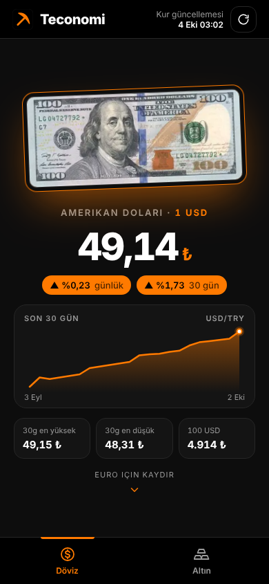
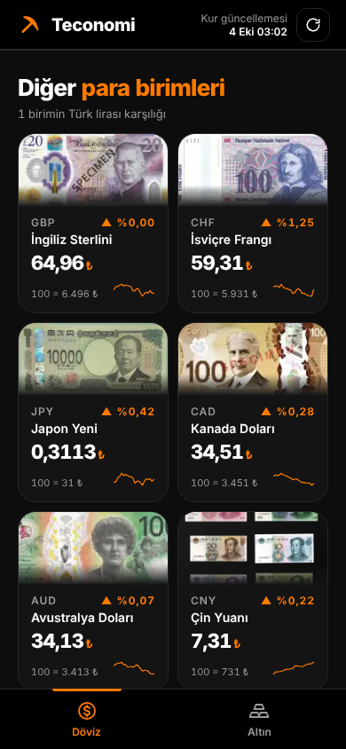
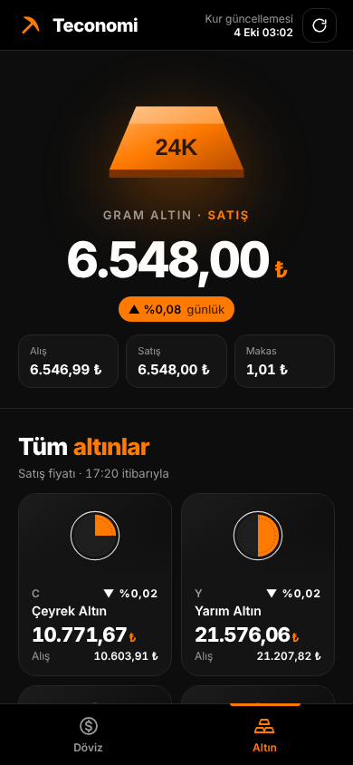

<p align="center"></p>

# Teconomi

Canlı döviz kurlarını ve altın fiyatlarını Türk lirası karşılığıyla gösteren, telefon ekranına göre tasarlanmış tek sayfalık uygulama. Kurulum, derleme ya da sunucu gerektirmez: her şey tek bir `index.html` dosyasındadır.

<p align="center">
  
  
  
</p>

## Özellikler

**Döviz sekmesi**

- Dolar ve euro için ayrı tam ekran: banknot görseli, 1 birimin TL karşılığı, günlük ve 30 günlük değişim, 30 günlük grafik, en yüksek / en düşük değer.
- Aşağı kaydırınca 10 para birimi daha: sterlin, İsviçre frangı, Japon yeni, Kanada doları, Avustralya doları, Çin yuanı, İsveç kronu, Suudi riyali, BAE dirhemi, Rus rublesi.

**Altın sekmesi**

- Gram altın için alış, satış ve makas.
- Çeyrek, yarım, tam, cumhuriyet, ata, reşat, hamit, gremse, beşli, 22 / 18 / 14 ayar, ons altın ve gram gümüş.

**Genel**

- Alt çubuktan sekme değiştirme, sağ üstten elle yenileme.
- İnternet kesilirse son başarılı veri gösterilir.

## Kullanım

### Tarayıcıda

`index.html` dosyasını indirip çift tıklamak yeterli.

### GitHub Pages ile yayınlama

1. Bu depoda **Settings → Pages** sayfasını aç.
2. **Source** olarak "Deploy from a branch" seç, dal olarak `main`, klasör olarak `/ (root)` seç ve kaydet.
3. Bir iki dakika sonra uygulama `https://KULLANICI-ADIN.github.io/DEPO-ADI/` adresinde açılır.

### Android

[`apk/Teconomi.apk`](apk/Teconomi.apk) dosyasını telefona indirip aç. Android 7 ve üstünde çalışır, yalnızca internet izni ister. Play Store dışından kurulduğu için telefon "bilinmeyen kaynak" izni isteyebilir.

## Veri kaynakları

| Veri | Kaynak | Not |
| --- | --- | --- |
| Döviz kurları | [open.er-api.com](https://open.er-api.com/v6/latest/USD) | Günde bir kez güncellenir |
| 30 günlük geçmiş | [frankfurter.dev](https://frankfurter.dev) | SAR, AED ve RUB için geçmiş verisi yok; bu kartlarda grafik çıkmaz |
| Altın fiyatları | [genelpara.com](https://api.genelpara.com/json/?list=altin&sembol=all) | Günlük 1000 istek sınırı var; uygulama 5 dakikada bir yeniler |
| Banknot görselleri | Wikimedia Commons / Wikipedia | Aşağıdaki nota bak |

Hiçbiri için API anahtarı gerekmez.

## Dosyalar

```
index.html              Uygulamanın tamamı (HTML + CSS + JavaScript)
icon.png                Uygulama simgesi (512×512)
apk/Teconomi.apk        Android kurulum dosyası
android/                APK'nın kaynakları (WebView kabuğu, manifest, simgeler)
ekran-goruntuleri/      README'deki görseller
```

## Özelleştirme

`index.html` içindeki `<script>` bölümünün başında:

- `OTHERS` listesi: gösterilen 10 para birimi. Satır ekleyip çıkararak değiştirilebilir.
- `NOTES` listesi: banknot görsellerinin adresleri. Kendi görsellerini kullanmak için depoya bir `img` klasörü açıp adresi `img/usd.png` gibi değiştir.
- `:root` içindeki `--orange`: ana tema rengi.

## Görseller hakkında

Banknot görselleri uygulamaya gömülü değildir, Wikimedia'dan çekilir. Dolar, euro, frank, yen, yuan ve ruble görselleri Wikimedia Commons'tandır. Sterlin, Kanada doları, Avustralya doları, İsveç kronu ve Suudi riyali görselleri ise İngilizce Vikipedi'de "adil kullanım" kaydıyla barındırılır, yani serbest lisanslı değildir. Uygulamayı geniş kitleye açacaksan bu beşini kendi görsellerinle değiştirmen daha güvenlidir. Bir görsel yüklenemezse yerine turuncu simge ya da ülke bayrağı gösterilir.

## Uyarı

Buradaki veriler yalnızca bilgi amaçlıdır, yatırım tavsiyesi değildir. Kurlar ve fiyatlar kaynaklardan gecikmeli gelebilir.
